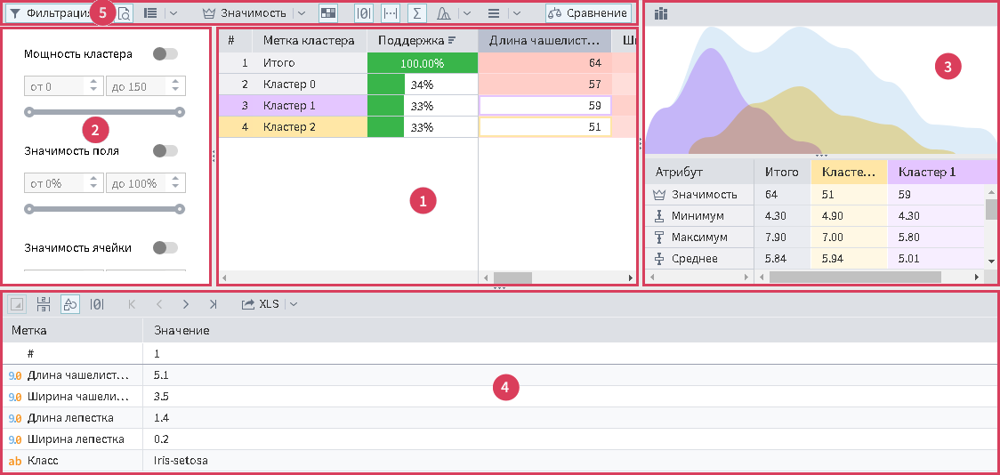

#  Профили кластеров

*Профили кластеров* — этот визуализатор позволяет определить структуру формирования группы кластеров, отображает общую статистику по кластерам и позволяет сравнить их между собой.

## Интерфейс

После добавления в узел визуализатора откроется главное окно (Рис. 1):

Главное окно условно можно разделить на 5 областей (см. рисунок 1):

1. **[Основная таблица](./main-table.md)** — отображает информацию о паре <кластер, поле>;
2. **[Панель фильтрации](./filter-panel.md)** — содержит настройки фильтрации *Основной таблицы*;
3. **Панель сравнения кластеров** — содержит сравнительную информацию по кластерам, выделенным в *Основной таблице*;
4. **Детализация** — отображает данные исходного набора данных,отфильтрованные по выделенным в *Основной таблице* кластерам;
5. **Панель инструментов** — настройка отображаемых данных.

>Примечание: *Панель фильтрации*, *Панели сравнения кластеров* и *Детализацию* можно изменить в размерах, если потянуть за линию разделитель левой кнопкой мыши. При двойном щелчке по линии разделителю или одинарном по середине линии, область будет скрыта.
