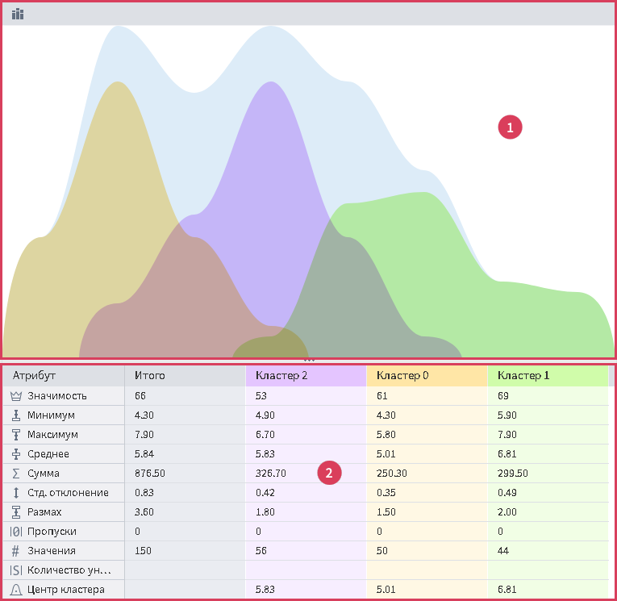

# Панель сравнения кластеров

Содержит сравнительную информацию по кластерам, выделенным в основной таблице. Цветовое кодирование и порядок кластеров совпадает с цветами и порядком выделения ячеек в основной таблице.

Панель разделена на две части (см. Рис 1):

1. **Верхняя часть панели** — содержит сравнительную гистограмму кластеров, в одной области совмещены гистограммы кластеров и генеральной совокупности. Верхняя часть панели содержит единственную настройку гистограммы в дополнении к общим настройкам гистограмм на [*Панели инструментов*](./toolbar.md):
   * **Накопительная диаграмма** — отображает один составной столбец, разбитый на цветные области, соответствующие кластерам.
2. **Нижняя часть панели** — содержит сводную таблицу значений индикаторов по выбранным кластерам в основной таблице.

>Примечание: Если одновременно включен режим "Накопительная гистограмма" и выбрана ячейка кластера "Итого", то в данные из этого не будут добавлены в накопительную гистограмму (поскольку они соответствуют генеральной совокупности).

>Примечание: Режим "Накопительная гистограмма" может быть включен, когда гистограммы имеют формат "Абсолютные частоты" или "Относительные частоты", в формате "Плотность вероятности" опция отключается и недоступна.

Гистограмма может быть двух видов:

* **Непрерывная гистограмма** — совпадает с таковой в ячейке таблицы;
* **Дискретная гистограмма** — представляет собой таблицу со следующими колонками:
  * **№** — номер уникального значения.
  *  **Метка** — метка уникального значения.
  *  **Доля** — колонка с столбцами горизонтальной гистограммы.
  *  **Итого** — колонка с количеством значений в колонках гистограммы генеральной совокупности. Отображается при включенной опции "Показывать генеральную совокупность в гистограммах" в *Панели инструментов*.
  *  **Метка кластера** — колонки с количеством значений в колонках гистограмм кластеров.

>Примечание: Все колонки, кроме колонки "Доля", можно сортировать.

>Примечание: Дискретная гистограмма не отображается для числа уникальных значений >10000.
