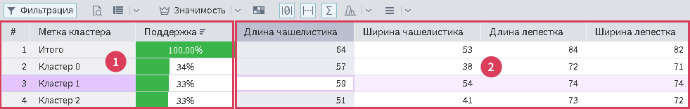

# Основная таблица

Таблица отображает статистические показатели по кластерам. Она состоит из закрепленной области с *Колонками легенды* (1), и основной области с *Колонками данных* (2) (см. Рис 1).

## Колонки легенды

*Колонки легенды* состоят из следующих колонок:

1. Кластеры в строках:
   * **Метка кластера** — порядковый номер кластера и строка *Итого*, которая содержит общую информацию по кластерам, если для текущего индикатора общее значение можно рассчитать;
   * **Поддержка** — отношение количества строк данных в кластере к общему числу строк данных;
2. Кластеры в колонках:
   * **Метка поля** — метка поля из исходного набора данных;
   * **Тип** — вид данных поля.

>Примечание: *Колонки легенды* откреплять нельзя.

## Колонки данных

*Колонки данных* состоят из следующих колонок:

1. Кластеры в строках:
   * **Метка поля** — метка поля из исходного набора данных;
2. Кластеры в колонках:
   * **Метка кластера** — порядковый номер кластера и колонка *Итого*, которая содержит общую информацию по кластерам, если для текущего индикатора общее значение можно рассчитать;
   * **Поддержка** — отношение количества строк данных в кластере к общему числу строк данных..

## Действия в таблице

* **Одиночная сортировка** — сортировать колонку по текущему индикатору. Тип сортировки можно выбрать двумя способами: через заголовочное меню выбранной колонки по клику на кнопку  и непосредственным кликом на колонку. При клике на колонку сортировка циклически меняется между следующими типами:
  *  По возрастанию;
  *  По убыванию;
  * Сбросить сортировку.
* **Перетаскивание колонок** — смена расположения колонок друг относительно друга, для этого необходимо зажать левую кнопку мыши на метке колонки, которую необходимо перетащить, затем переместить курсор мыши в нужное место и отпустить левую кнопку мыши;
* **Закрепление/открепление колонки** — закрепить/открепить колонку, для этого необходимо в заголовочном меню колонки по клику на кнопку выбрать пункт меню *Снять закрепление столбца* или *Закрепить столбец*;
* **Сокрытие/отображение столбцов легенды** — показать/скрыть столбцы легенды, для этого необходимо в их заголовочном меню по клику на кнопку  выбрать пункт меню  *Столбцы* и снять/установить галочки на столбцах, которые необходимо скрыть или показать;
* **Выделение ячеек** — для выделения ячейки таблицы необходимо кликнуть по ячейке. Есть 2 режима выделения:
    * **Одиночное** — сбрасывает все существующее выделение и выделяет только текущую ячейку. Выделение можно перемещать с помощью кнопок клавиатуры %kbd Up %, %kbd Down %, %kbd Left %, %kbd Right %.
    * **Множественное** — выделяет сразу несколько ячеек, для множественного выделения необходимо при клике зажать клавишу %kbd Ctrl %, которая добавляет в выделение ячейку или удаляет ячейку из него. Если выделено несколько ячеек, то возможна смена текущего поля:
      * Кнопками %kbd Up %, %kbd Down %, если поля в строках;
      * Кнопками %kbd Left %, %kbd Right %, если поля в колонках.

>Примечание: Можно выделять только ячейки в пределах одного поля и одновременно может быть выделено не более 7 ячеек.

## Гистограммы

Гистограммы содержат 3 типа столбцов:

1. **Null столбец** — столбец с пропусками в дискретных гистограммах. Видимость столбца можно изменить с помощью кнопки  *Показывать null столбец в гистограммах* на [*Панели инструментов*](./toolbar.md).
2. **Основные столбцы** — гистограмма, отображающая столбцы у дискретных гистограмм и сплошную заливку под непрерывной гладкой кривой у непрерывных.
3. **Столбец "Прочие"** — столбец с аккумулированными значениями не уместившихся столбцов в дискретных гистограммах. Видимость столбца можно изменить с помощью кнопки *Показывать столбец "Прочие" в гистограммах* на *Панели инструментов*.

>Примечание: Текущее ограничение на количество столбцов для дискретной гистограммы в ячейке — 12.
