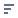

#  Куб

## Описание

[Куб](https://wiki.loginom.ru/articles/cube.html) является одним из распространенных методов комплексного многомерного анализа данных, получивших название [OLAP](https://wiki.loginom.ru/articles/online-analytical-processing.html) (OnLine Analytical Processing). В его основе лежит представление данных в виде многомерных кубов, называемых также OLAP-кубами или гиперкубами.

Куб — это удобное средство визуализации многомерных данных и получения необходимых форм отчетов. Он строится на основе многомерного представления данных и содержит измерения и факты, определенные при построении. К основной особенности куба относится то, что его структура не является жестко определенной. Манипулируя с помощью мыши заголовками измерений, пользователь может добиться, чтобы куб выглядел наиболее информативно.

## Интерфейс

### Операции

*  **Поля** — показать/скрыть список полей набора данных.
*  **Диаграмма** — показать/скрыть [диаграмму](./chart.md).
*  **Свернуть** — свернуть иерархию измерений куба.
  * Свернуть все.
  * Свернуть колонки.
  * Свернуть строки.
*  **Развернуть** — развернуть иерархию измерений куба.
  * Развернуть все.
  * Развернуть колонки.
  * Развернуть строки.
*  **Итоги** — показать/скрыть итоги по кубу.
  * Все.
  * В колонках.
  * В строках.
  * Нигде.
*  **Выравнивание** ширины:
  * Колонок.
  * Фактов.
*  **Транспонировать** — переместить измерения, находящиеся в строках, в столбцы и наоборот.
*  **Добавить вычисляемый факт** — [добавить вычисляемый факт](./addcalculatingfact.md) в куб.

### Настройка куба

В левом списке отображаются поля, которые можно использовать в качестве измерений и фактов.

#### Измерения

Добавить измерения в строки или столбцы куба можно двумя способами:

* Перетащить (Drag&Drop) поле из левого списка в ту область, в которую его необходимо добавить: строки или столбцы;
* Нажать кнопку  нужной области и выбрать необходимое поле из списка.

Чтобы отсортировать значения измерения, необходимо нажать кнопку  рядом с нужным измерением и выбрать необходимый вариант:

*  **По возрастанию** — отсортировать значения в порядке возрастания;
*  **По убыванию** — отсортировать значения в порядке убывания;
* **В исходном порядке** — выстроить значиния в изначальном порядке.

Чтобы отфильтровать данные по измерению необходимо щёлкнуть по нужному измерению, выбрать значения из списка уникальных и нажать "Применить".
При этом доступны операции:

*  **Выбрать все** — выбрать все значения списка;
*  **Отменить выбор** всех — снять выбор всех значений списка;
*  **Инвертировать выбор** — поменять выбранные значения списка на невыбранные и наоборот.

Удалить измерение можно:

* Нажав кнопку  рядом с нужным измерением и выбрав  Удалить.

> **Примечание:** Над областью настройки измерений куба находится область фильтрации, она заполняется и имеет те же параметры сортировки и фильтрации, что и область настройки измерений, но измерения добавленные в эту область не будут отображаться в кубе, зато они могут быть использованы в вычисляемых фактах и для фильтрации данных в кубе.

#### Факты

Добавить факты можно двумя способами:

* Перетащить (Drag&Drop) поле из левого списка в область фактов куба;
* Нажать кнопку Факты, выбрать необходимое поле и в появившемся [окне](./addfact.md) выбрать нужный вариант [агрегации](../../processors/func/aggregation-functions.md) и способ его отображения.

Нажав на кнопку  рядом с Факты можно открыть одно из окон:

*  [Форматировать факты](./formatfacts.md);
*  [Фильтровать факты](./filterfacts.md);
*  [Настроить факты](./configurefacts.md).

>**Примечание:** По умолчанию в качестве варианта агрегации и способа его отображения выбирается идущий первым по списку. Поддерживается отображение сразу нескольких вариантов агрегации и способов их отображения для каждого факта.