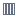

# Диаграмма

[Диаграмма](../chart/README.md) куба представляет собой диаграмму заданного типа, построенную на основе куба. Основное отличие диаграммы куба от обычной в том, что она однозначно соответствует текущему состоянию куба и при любых его изменениях меняется соответственно.

## Панель инструментов

Содержит следующие кнопки:

* **Вид диаграммы** — позволяет выбрать вид отображаемой диаграммы.
  *  Линии.
  *  Области.
  *  Сплайны.
  *  Столбчатая.
  *  Сглаженные области.
  *  Разброс.
* **Расположение серий** — позволяет выбрать расположение серий.
  *  В столбцах — построение серии диаграммы по данным столбца.
  *  В строках — построение серии диаграммы по данным строки.
* **Итоги** — показать/скрыть итоги.
  *  Скрыть.
  *  Показать.
* **Отображаемый факт** — позволяет выбрать отображаемый факт из списка.
* **Ограничения** — позволяет задать ограничения на количество серий/точек.
  * Диапазон задания количества серий: [1;100].
  * Диапазон задания количества точек: [1;1000].
* **Экспорт** — позволяет экспортировать диаграмму в определённый формат.
  * PNG.
  * JPEG.
  * PDF.
  * SVG.

При наведении на точку серии появляется подсказка со значением. Чтобы отключить серию, необходимо нажать по ней на легенде диаграммы.
