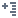

# Настроить факты

Позволяет, выставляя флаги у нужных фактов/вариантов агрегации и способов отображения, настроить отображаемые факты.

> **Примечание:** В списке присутствует фиктивный факт Количество, который существует даже тогда, когда ни одно поле исходного набора данных не используется в качестве факта. Для него предлагается один единственный вариант агрегации – Количество, смысл которого точно такой же, как и для обычного факта.

## Операции

*  Переместить вверх — переместить факт/вариант агрегации/способ отображения на позицию вверх;
*  Переместить вниз — переместить факт/вариант агрегации/способ отображения на позицию вниз;
*  Свернуть дерево — свернуть дерево фактов;
*  Развернуть дерево — развернуть дерево фактов;
*  Выбрать все — выбрать все факты, варианты агрегации со всеми способами отображения;
*  Отменить выбор всех — убрать выбор всех фактов, вариантов агрегации со всеми способами отображения;
*  [Добавить вычисляемый факт](./addcalculatingfact.md) — добавить вычисляемый факт в куб;
*  Редактировать вычисляемый факт — открыть окно редактирования вычисляемого факта;
*  Удалить вычисляемый факт.
