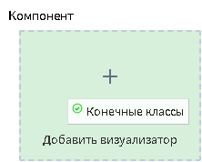
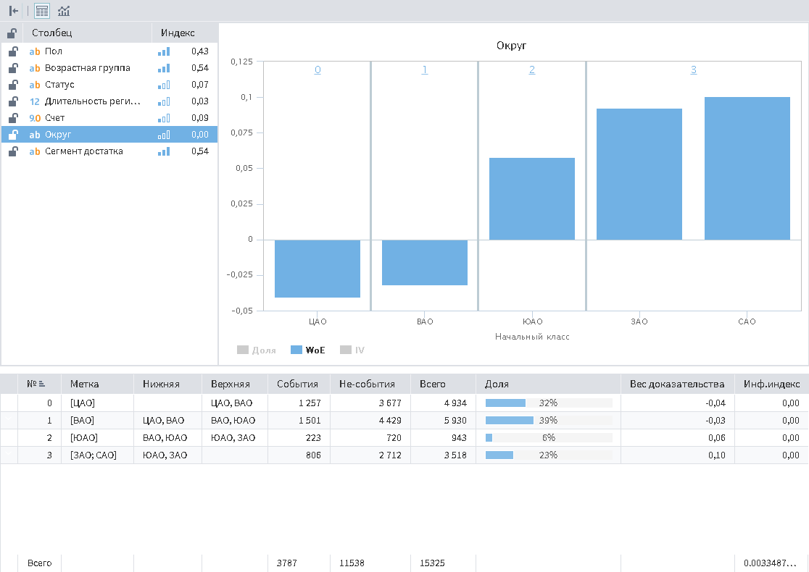
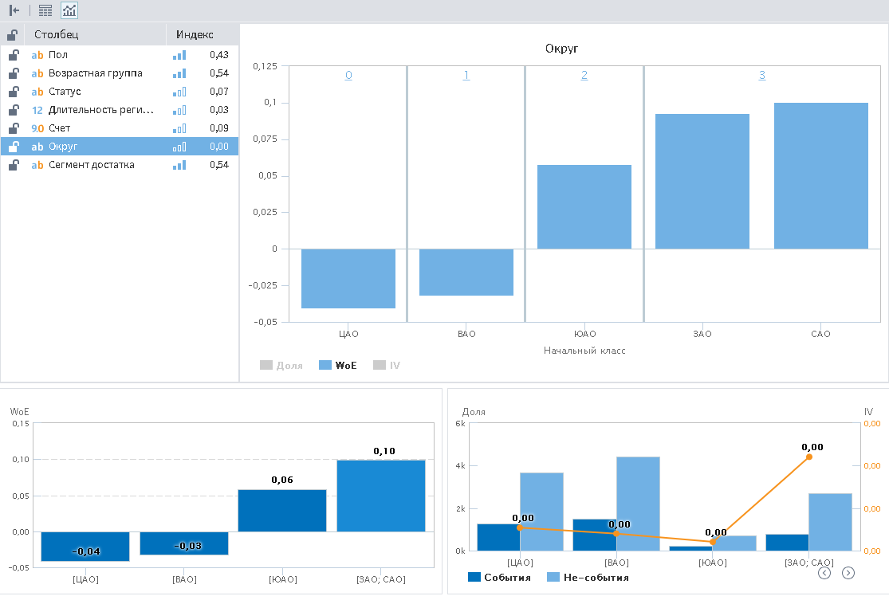

# Конечные классы

## Описание

Визуализатор "Конечные классы" предназначен для просмотра начальных и конечных классов.

Данный визуализатор включает в себя:

* Список входных столбцов, для каждого из которых указывается оцененный уровень значимости;
* Диаграмму начальных классов;
* Таблицу или диаграммы конечных классов.

**Примечение:** Визуализатор "Конечные классы" может использоваться только с одноименным узлом.

## Интерфейс

Для того, чтобы включить возможность использовать визуализатор "Конечные классы" необходимо в свободном пространстве области добавления визуализаторов нажать правую кнопку мыши и в открывшемся окне выбрать пункт "Показать порт Компонент". (см. рисунок 1)

*Рисунок 1. Включение порта "Компонент"*

После включения порта появится возможность добавить визуализатор "Конечные классы" (см. рисунок 2).

*Рисунок 2. Добавление визуализатора "Конечные классы"*

## Режимы отображения

В Loginom существует два режима отображений конечных классов:

* Таблица (см. рисунок 3);
* Диаграммы (см. рисунок 4).

Режимы можно включать комбинацией клавиш ALT+1 (для режима "Таблица") и ALT+2 (для режима "Диаграммы"), либо кнопками на панели инструментов.

*Рисунок 3. Режим "Таблица"*

*Рисунок 4. Режим "Диаграммы"*