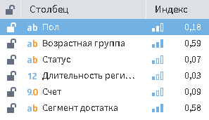
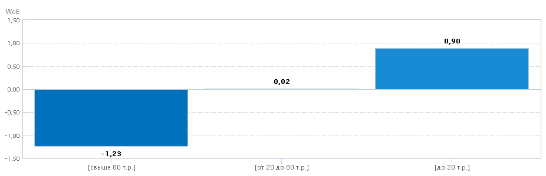
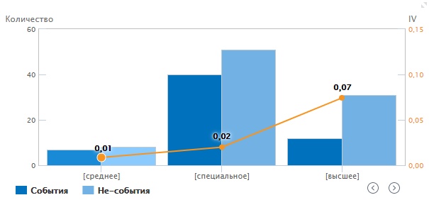
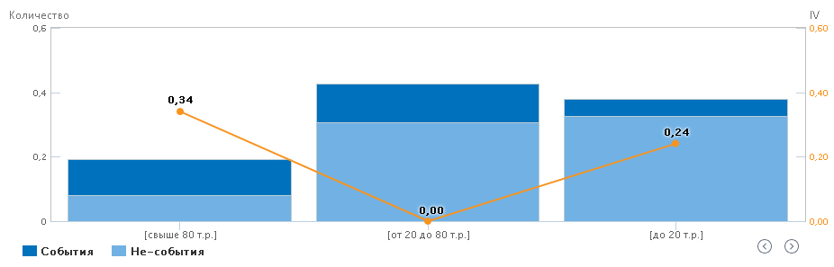
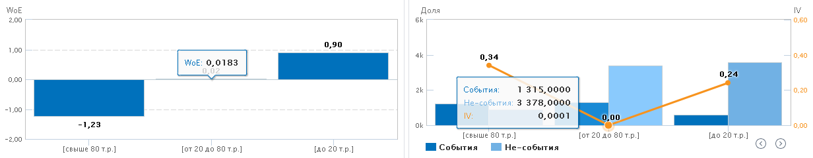

#  Конечные классы

## Описание

Визуализатор "Конечные классы" предназначен для следующих задач:

* Преобразование непрерывных и дискретных входных полей, используемых для построения моделей бинарной классификации, путем квантования на основе метода совокупности доказательств или WoE-анализа (weights of evidence, WoE);
* Сокращение размерности данных за счет исключения признаков с низкой значимостью, снижения разнообразия значений признаков;
* Восстановление пропусков, когда пропуски образуют отдельную метку интервала квантования или объединяются с соседним, близким по значению WoE-индекса;
* Борьба с выбросами и экстремальными значениями — формирование меток интервала квантования при дискретизации непрерывного поля или объединение редких уникальных значений в одну категорию позволяет решить проблему экстремальных значений и выбросов;
* Упрощение описания исследуемых объектов.

Данный визуализатор включает в себя:

* [Список входных столбцов](#spisok-vkhodnykh-stolbtsov);
* [Область начальных классов](#oblast-nachalnykh-klassov);
* [Область конечных классов](#oblast-konechnykh-klassov), которая может быть представлена в виде ["Таблицы"](#tablitsa) или ["Диаграммы"](#diagramma).

>**Примечание:** Визуализатор "Конечные классы" может использоваться только с узлом "[Конечные классы](../../processors/preprocessing/fine-classes.md)".

## Интерфейс

### Операции

#### Список входных столбцов

* Скрыть боковую панель.

#### Область конечных классов

*  Показать таблицу конечных классов (см. [Таблица](#tablitsa));
*  Показать диаграммы конечных классов (см. [Диаграмма](#diagramma)).

### Список входных столбцов

* Статус узла:
  *  "Разморожено" — показывает, что данный узел может быть использован в процессе формирования конечных классов при переобучении модели;
  *  "Заморожено" — показывает, что при переобучении данный узел не будет использоваться.
* Метка столбца;
* Оцененный уровень значимости IV (см. рисунок 1).

### Область начальных классов

При наведении курсора мыши на диаграмму в правом верхнем углу появляется кнопка , нажав на которую, диаграмма развернется на всю область визуализатора.

Начальные классы представлены в виде одного варианта отображения — диаграммы.

Диаграмма начальных классов может представлять:

* Долю;
* WoE (вес доказательства);
* IV (информационный индекс).

Выбор отображения переключается кнопками (см. рисунок 2) в нижней части диаграммы.

При увеличении диаграммы во всю область визуализатора, появляется выпадающее меню, в котором для выбранного столбца будет построена диаграмма (см. рисунок 3).

При наведении на столбец диаграммы появляется всплывающее меню, которое отображает значение поля и значение WoE/IV/Доли (см. рисунок 3).

### Область конечных классов

Конечные классы отображаются в виде [таблицы](#tablitsa) или [диаграмм](#diagramma):

* WoE (см. рисунок 4);
* IV может отображать:
  * Количество (см. рисунок 5);
  * Доля (см. рисунок 6).

#### Таблица

Таблица состоит из следующих полей:

| Поле | Описание |
|:--------------------|:----------|
| № | Номер класса |
| Метка | Совокупность названий начальных классов, которые входят в конечный класс |
| Нижняя | Нижняя граница интервала |
| Верхняя | Верхняя граница интервала |
| События | Одно из состояний бинарной целевой переменной класса |
| Не-события | Противоположное состояние бинарной целевой переменной класса |
| Всего | Сумма событий и не-событий класса|
| Доля | Доля конечного класса от общего объема записей  |
| Вес доказательства | Коэффициент WoE |
| Инф.индекс | Величина, определяющая значимость признака в модели бинарной классификации |

В нижней части таблицы отображается сумма:

* Событий всех классов;
* Не-событий всех классов;
* Событий и не-событий всех классов;
* Информационных индексов всех классов.

#### Диаграмма

При наведении курсора мыши на диаграмму в правом верхнем углу появляется кнопка , нажав на которую, диаграмма развернется на всю область визуализатора.

Диаграммы "Количество" и "Доля" переключаются между собой кнопками  .

При наведении на столбец диаграммы всплывает два окна (см. рисунок 7):

* Окно для диаграммы "WoE" отображает:
  * Значение WoE.
* Окно для диаграммы "IV" отображает:
  * Значение IV;
  * Число "Событий";
  * Число "Не-событий".

