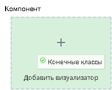
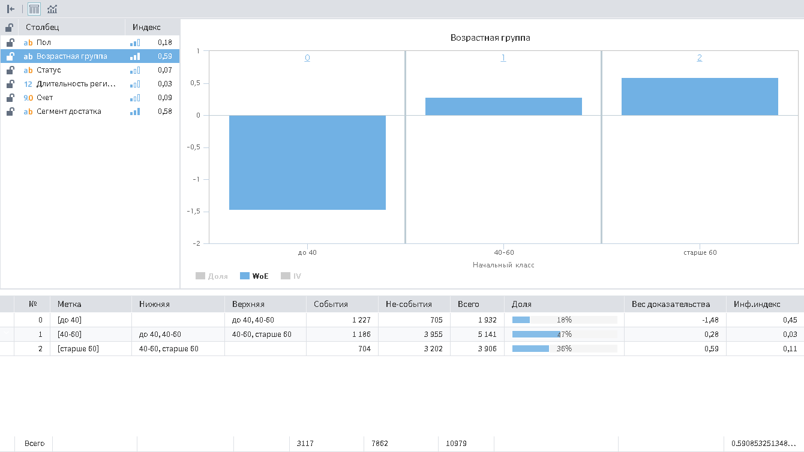

# Конечные классы

## Описание

Визуализатор "Конечные классы" показывает результаты процедуры оптимального квантования в виде
начальных и конечных классов, а также WoE-диаграммы и значений информационных
индексов IV.

Данный визуализатор включает в себя:

* Список входных столбцов, для каждого из которых указывается оцененный уровень значимости (см. рисунок 1);
* Диаграмму начальных классов;
* Таблицу или диаграммы конечных классов.

----

**Примечение:** Визуализатор "Конечные классы" может использоваться только с одноименным узлом.

----

## Добавление визуализатора

Для того, чтобы включить возможность использовать визуализатор "Конечные классы" необходимо в свободном пространстве области добавления визуализаторов нажать правую кнопку мыши и в открывшемся окне выбрать пункт "Показать порт Компонент". (см. рисунок 2)

После включения порта появится возможность добавить визуализатор "Конечные классы" (см. рисунок 3).

## Интерфейс

### Навигация

Навигация по конечным классам осуществляется мышкой.

### Операции

* Скрыть боковую панель;
* Показать таблицу конечных классов (см. [Отображение классов](./display-mode.md));
* Показать диаграммы конечных классов (см. [Отображение классов](./display-mode.md)).