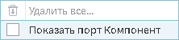

# Конечные классы

## Описание

Визуализатор "Конечные классы" показывает результаты процедуры оптимального квантования в виде
начальных и конечных классов, а также WoE-диаграммы и значений информационных
индексов IV.

Данный визуализатор включает в себя:

* Список входных столбцов, для каждого из которых указывается оцененный уровень значимости;
* Диаграмму начальных классов;
* Таблицу или диаграммы конечных классов.

----

**Примечение:** Визуализатор "Конечные классы" может использоваться только с одноименным узлом.

----

## Добавление визуализатора

Для того, чтобы включить возможность использовать визуализатор "Конечные классы" необходимо в свободном пространстве области добавления визуализаторов нажать правую кнопку мыши и в открывшемся окне выбрать пункт "Показать порт Компонент". (см. рисунок 1)

*Рисунок 1. Включение порта "Компонент"*

После включения порта появится возможность добавить визуализатор "Конечные классы" (см. рисунок 2).

*Рисунок 2. Добавление визуализатора "Конечные классы"*

## Интерфейс

### Навигация

Навигация по конечным классам осуществляется мышкой.

### Отображение классов

#### Начальные классы

Начальные классы представлены в виде одного варианта отображения — диаграммы.

Диаграмма начальных классов может отображать:

* Долю;
* WoE (вес доказательства);
* IV (информационный индекс).

Выбор отображения переключается в нижней части диаграммы.

#### Конечные классы

В Loginom существует два режима отображений конечных классов:

* Таблица (см. рисунок 3), состоящая из следующих полей:
  * Номер класса;
  * Нижняя граница;
  * Верхняя граница;
  * События;
  * Не-события;
  * Всего;
  * Доля;
  * Вес доказательства;
  * Информационный индекс.
* Диаграммы (см. рисунок 4).

Режимы можно включать комбинацией клавиш ALT+1 (для режима "Таблица") и ALT+2 (для режима "Диаграммы"), либо кнопками на панели инструментов.

*Рисунок 3. Режим "Таблица"*

*Рисунок 4. Режим "Диаграммы"*

----

**Примечание:** Диаграмму "Доля" можно сменить на диаграмму "Количество" нажав на стрелочки под ней.