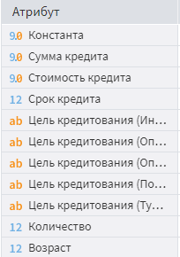
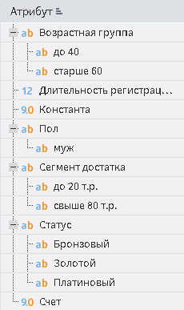

# Отчет по регрессии

## Описание

## Интерфейс

Для того, чтобы включить возможность использовать визуализатор "Отчет по регрессии" необходимо в свободном пространстве области добавления визуализаторов нажать правую кнопку мыши и в открывшемся окне выбрать пункт "Показать порт Компонент". (см. рисунок 1)

*Рисунок 1. Включение порта "Компонент"*

После включения порта появится возможность добавить визуализатор "Отчет по регрессии" (см. рисунок 2).

*Рисунок 2. Добавление визуализатора "Отчет по регрессии"*