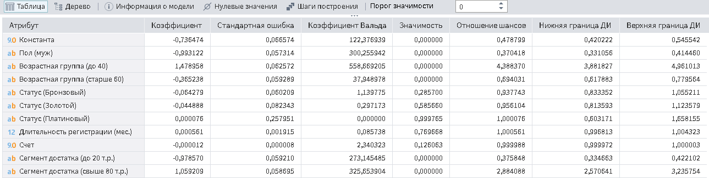
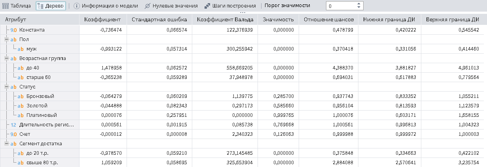

# Отчет по регрессии

## Описание

Визуализатор "Отчет по регрессии" отображает статистические параметры и результаты статистических тестов для анализа регрессионных моделей.

Данный визуализатор состоит из двух частей:

* Информации о модели (см. рисунок 1);
* [Коэффициентов регрессии](#rezhimy-otobrazheniya).

*Рисунок 1. Информация о модели*

----

**Примечение:** Визуализатор "Отчет по регрессии" может использоваться только с одноименным узлом.

----

## Добавление визуализатора

Для того, чтобы включить возможность использовать визуализатор "Отчет по регрессии" необходимо в свободном пространстве области добавления визуализаторов нажать правую кнопку мыши и в открывшемся окне выбрать пункт "Показать порт Компонент". (см. рисунок 2)

*Рисунок 2. Включение порта "Компонент"*

После включения порта появится возможность добавить визуализатор "Отчет по регрессии" (см. рисунок 3).

*Рисунок 3. Добавление визуализатора "Отчет по регрессии"*

## Интерфейс

### Навигация

Навигация в визуализаторе "Отчет по регрессии" и его настройка осуществляется при помощи мышки.

### Режимы отображения

Коэффициенты регрессии могут быть представлены в виде таблицы (см. рисунок 4) или дерева (см. рисунок 5). Режим отображения можно выбрать кнопками на панели инструментов.

*Рисунок 4. Режим отображения "Таблица"*

*Рисунок 5. Режим отображения "Дерево"*