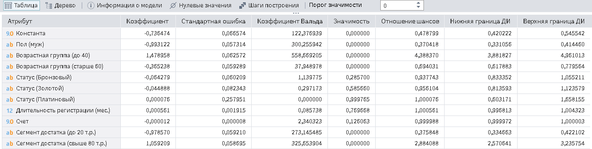
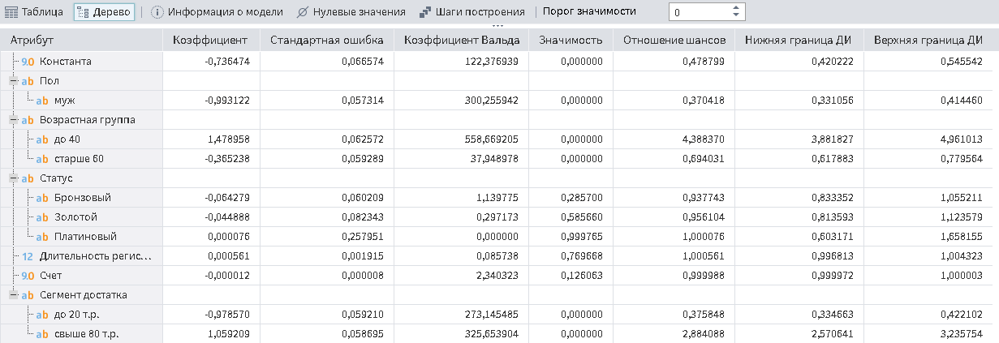

# Коэффициенты регрессии

Описание коэффициентов представлено в таблице:

| Коэффициент | Описание |
|:--------------------|:----------|
| Коэффициент | Коэффициент |
| Стандартная ошибка | Мера разброса данных наблюдений от смоделированных значений. |
| Коэффициент Вальда | Оценка значимости коэффициента при независимой переменной модели  |
| Значимость | Степень статистической связи между входной (набором входных) и выходной переменными регрессионной модели |
| Отношение шансов | Отношение вероятности того, что событие произойдет к вероятности того, что событие не произойдет |
| Нижняя граница ДИ | Нижняя граница доверительного интервала |
| Верхняя граница ДИ | Верхняя граница доверительного интервала |
Коэффициенты регрессии могут быть представлены в виде таблицы (см. рисунок 1) или дерева (см. рисунок 2). Режим отображения можно выбрать кнопками на панели инструментов.

*Рисунок 1. Режим отображения "Таблица"*

*Рисунок 2. Режим отображения "Дерево"*