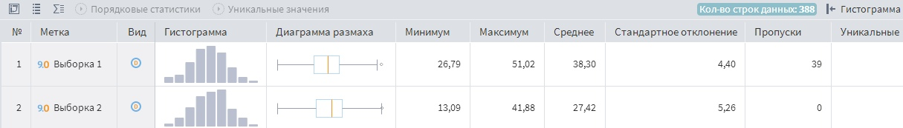
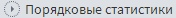
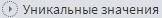
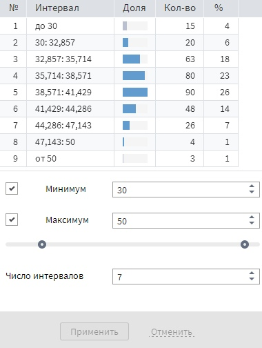

# Статистика

## Описание

Визуализатор "Статистика" предназначен для просмотра различных [статистических показателей](./statistics-description.md) по каждому полю набора данных. Данный визуализатор представляет из себя таблицу, наименования полей набора данных которого расположены в строках, а наименования статистические показателей находятся в столбцах. На пересечении (в ячейках таблицы) расположены значения статистических показателей соответствующих полей.

## Операции

* Транспонирование таблицы — переворот таблицы, при котором наименования полей отображаются в столбцах, а статистические показатели показатели - в строках;
* Настройка полей — регулировка отображений полей набора данных в таблице визуализатора;
* Настройка показателей — регулировка отображений статистических показателей в таблице визуализатора. По умолчанию отображаются 8 показателей (см. Рисунок 1):
  * Гистограмма;
  * Диаграмма размаха;
  * Минимальное;
  * Максимальное;
  * Среднее;
  * Стандартное отклонение;
  * Количество пропусков;
  * Количество уникальных значений.

  
*  — подсчитываются порядковые статистики:
  * Медиана;
  * Нижний квартиль;
  * Верхний квартиль;
  * Межквартильное расстояние;
  * Медианное абсолютное отклонение.
*  — подсчитывается количество уникальных значений.

   >**Примечание:** При маленьких количествах полей и/или элементов выбоки порядковые статистики и уникальные значения подсчитываются автоматически, т.е без использования соответствующих кнопок.
*  — более подробное представление гистограммы. Данная операция предоставляет возможность задать собственные параметры гистограммы (см. Рисунок 2):
  * Минимальное значение выборки;
  * Максимальное значение выборки;
  * Число интервалов гистограммы.

>**Примечание:** также, в  имеется информация о количестве записей набора данных, к которому применяется данный визуализатор. 