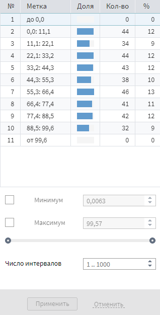

# Статистика

## Описание

Визуализатор «Статистика» предназначен для просмотра различных [статистических показателей](./statistics-description.md) по каждому полю набора данных. Данный визуализатор представляет из себя таблицу, наименования полей набора данных которого расположены в строках, а наименования статистические показателей находятся в столбцах. На пересечении, в ячейках таблицы, расположены значения статистических показателей соответствующих полей (см. Рисунок 1).

>**Примечание:** В случае, если данных много, то гистограмма, диаграмма размаха, порядковые статистики и уникальные значения не отображаются. Для их подсчета нужно нажать на соответствующие кнопки.

## Операции

*  **Транспонирование таблицы** — переворот таблицы, при котором наименования полей отображаются в столбцах, а статистические показатели — в строках;
*  **Настройка полей** —  выбор полей набора данных, для которых будут подсчитаны статистические показатели;
*  **Настройка показателей** — выбор статистических показателей;
*  **Порядковые статистики**— подсчитываются порядковые статистики;
*  **Уникальные значения**— подсчитывается количество уникальных значений;
*  **Гистограмма** — операция, открывающая детализированное окно с расширенными настройками гистограммы.

>**Примечание:** Количество записей набора данных, к которому применяется данный визуализатор, можно узнать в графе **Кол-во строк данных:**, расположенной в правой части панели инструментов.

### Настройка показателей

По умолчанию отображаются следующие 8 показателей:
* Гистограмма;
* Диаграмма размаха;
* Минимум;
* Максимум;
* Среднее;
* Стандартное отклонение;
* Пропуски;
* Уникальные.

В случае, если их недостаточно, [весь перечень](./statistics-description.md) доступен с помощью операции  **Настройка показателей**.

### Детализированное окно гистограммы

Выбрав необходимое поле, а затем нажав на кнопку  **Гистограмма**, в правой части интерфейса открывается дополнительное окно с расширенными настройками и более подробным описанием гистограммы (см. Рисунок 2).

Доступны следующие опции:
* Сортировка показателей гистограммы по убыванию/возрастанию;
* Настройка отображения показателей гистограммы; 
* Задать собственное максимальное значение поля;
* Задать собственное минимальное значение поля;
* Задать собственное количество интервалов (в случае, если поле непрерывного типа);
* Включить Null-значения в гистограмму (в случае, если поле дискретного типа).
 
>**Примечание:** Изменяя вышеперечисленные опции, визуализация гистограммы изменяется только в детализированном окне, а в основном окне визуализатора останется прежней.