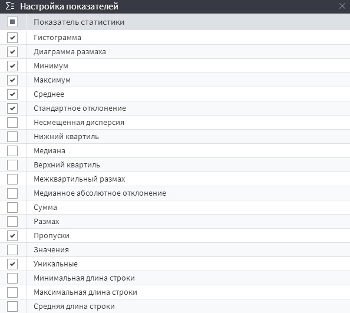

# Статистика

## Описание

Визуализатор «Статистика» предназначен для просмотра различных [статистических показателей](./statistics-description.md) по каждому полю набора данных. Данный визуализатор представляет из себя таблицу, наименования полей набора данных которого расположены в строках, а наименования статистические показателей находятся в столбцах. На пересечении, в ячейках таблицы, расположены значения статистических показателей соответствующих полей (см. Рисунок 1).

## Операции

*  **Транспонирование таблицы** — переворот таблицы, при котором наименования полей отображаются в столбцах, а статистические показатели показатели — в строках;
*  **Настройка полей** — регулировка отображений полей набора данных в таблице визуализатора;
*  **Настройка показателей** — регулировка отображений статистических показателей в таблице визуализатора.
*  — подсчитываются порядковые статистики;
*  — подсчитывается количество уникальных значений;
*  — операция,открывающая детализированное окно с расширенными настройками гистограммы.
 >**Примечание:** также, в  имеется информация о количестве записей набора данных, к которому применяется данный визуализатор.

### Настройка показателей

 По умолчанию отображаются 8 показателей. В случае, если их недостаточно, весь перечень доступен с помощью операции  **Настройка показателей** (см. Рисунок 2).

### Детализированное окно гистограммы

Выбрав необходимое поле, а затем нажав на кнопку , в правой части интерфейса открывается дополнительное окно с расширенными настройками и более подробным описанием гистограммы (см. Рисунок 3).

Доступны следующие опции:
 * Задать собственное максимальное значение поля;
 * Задать собственное минимальное значение поля;
 * Задать собственное количество интервалов.
 >**Примечание:** Изменяя вышеперечисленные опции, визуализация гистограммы изменяется только в детализированном окне, а в основном окне визуализатора останется прежней.